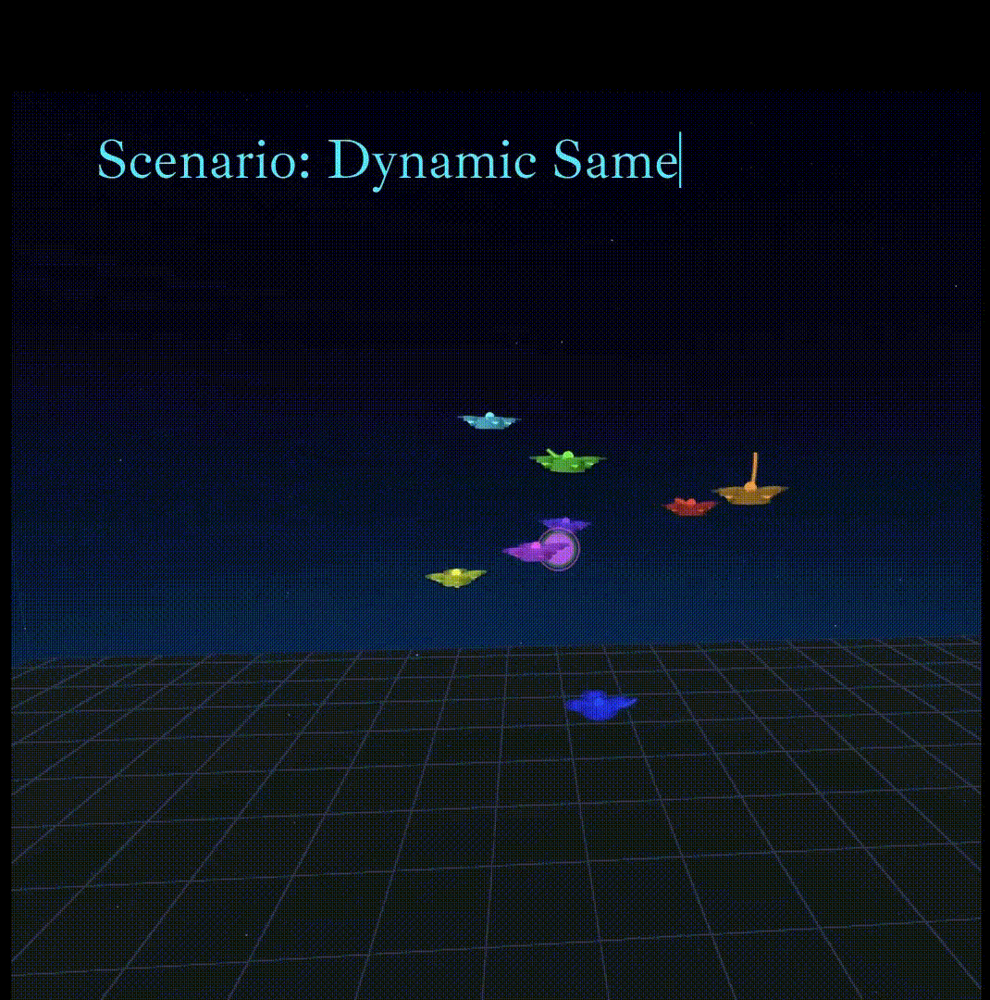

# Drone Simulator: Quadrotor Swarm

Based on:
https://github.com/Zhehui-Huang/quad-swarm-rl

Paper:
https://arxiv.org/pdf/2109.07735

-----------------------------------------------------------------

<p align="center">
  
  
</p>


## Why This Version

In the original repository, I encountered persistent issues running the built-in visualization on my machine (Ubuntu 24.04). Although the author confirmed it works on their own 24.04 setup, the problem seemed to be specific to my environment. To help others who might face similar compatibility issues, I decided to implement a custom 3D visualization using Three.js. While enhancing the simulation, I also introduced a new evader-pursuit scenario to enrich the swarm behavior dynamics


## New Features

- **Enhanced Visualization**  
  Integration of Three.js for 3D visualization interface

- **Added New Scenario**  
  - The classic figure-eight ∞ curve (Bernoulli's lemniscate) (3D version) 
  - Scenario name: ep_figure8_lemniscate (For evader-pursuit)

## Setup

### Conda

```bash
conda create -n quadrotor_swarm python=3.11
```

```bash
conda activate quadrotor_swarm
```

### Packages

```bash
git clone https://github.com/ali-kosemen/quadrotor-swarm.git
```

```bash
cd quadrotor_swarm
```

```bash
pip install -e .
```


## Train

For train single drone
```bash
./train_single.sh
```

In ***quadrotor_swarm/swarm_rl/runs/single_quad/baseline.py***, you can change some parameters (quads_mode for scenario choice etc.)

For train multi drone (default 8 drones)
```bash
./train_multi.sh
```

In ***quadrotor_swarm/swarm_rl/runs/multi_quad/baseline.py***, you can change some parameters (quads_mode for scenario choice etc.)


To monitor the experiments

```bash
tensorboard --logdir=./
```

## Test (Inference Mode)

First, start the HTTP server for web UI

```bash
./web_server.sh
```

Secondly, launch the WebSocket server to enable real-time data transmission to the web UI

```bash
./web_inference.sh APPO quadrotor_multi_websocket <train_dir> <experiment_name>
```

<experiment_name> and <train_dir> are set in the config.json file of your trained model

Lastly, go to the HTTP server URL

```bash
http://localhost:8083
```

## Pre-trained Models

I have trained models for several scenarios

- [Dynamic Same Goal (8 Quadrotors)](https://drive.google.com/drive/folders/1bLC6gLupL-3NC-QbU_iExu3E3ZOLkQC7?usp=sharing)

- [Evader-Pursuit Lissajous (8 Quadrotors)](https://drive.google.com/drive/folders/1eRF4qvQsL4FPrRAV7ku7AhEpozlTqA6K?usp=sharing)

- [Evader-Pursuit Bernoulli Lemniscate (8 Quadrotors)](https://drive.google.com/drive/folders/1g7eD59aVhC194AYm8pB0tO7kLeSkiaFo?usp=sharing)

- [Swarm vs Swarm (8 Quadrotors)](https://drive.google.com/drive/folders/1stcez7RVPea_FPgnqeO2B05Ff-oril1b?usp=sharing) (Not fully stable, but still capable of demonstrating reasonable behavior)

- [Swap Goals (8 Quadrotors)](https://drive.google.com/drive/folders/1fOuFVn7WClnU5ugA6wUitaqX_dtdldGH?usp=sharing) (Not fully stable, but still capable of demonstrating reasonable behavior)

Drag and drop the model folder (starts with test_) you downloaded directly into the train_dir. Then, simply provide the paths of experiment_name and train_dir from the config.json file to the inference command

## Citation

If you use this repository in your work or otherwise wish to cite it, please make reference to following papers

### QuadSwarm: A Modular Multi-Quadrotor Simulator for Deep Reinforcement Learning with Direct Thrust Control 
[ICRA Workshop: The Role of Robotics Simulators for Unmanned Aerial Vehicles, 2023](https://imrclab.github.io/workshop-uav-sims-icra2023/)

Drone Simulator for Reinforcement Learning.
```
@article{huang2023quadswarm,
  title={Quadswarm: A modular multi-quadrotor simulator for deep reinforcement learning with direct thrust control},
  author={Huang, Zhehui and Batra, Sumeet and Chen, Tao and Krupani, Rahul and Kumar, Tushar and Molchanov, Artem and Petrenko, Aleksei and Preiss, James A and Yang, Zhaojing and Sukhatme, Gaurav S},
  journal={arXiv preprint arXiv:2306.09537},
  year={2023}
}
```

### Sim-to-(Multi)-Real: Transfer of Low-Level Robust Control Policies to Multiple Quadrotors
IROS 2019

Single drone: a unified control policy adaptable to various types of physical quadrotors.
```
@inproceedings{molchanov2019sim,
  title={Sim-to-(multi)-real: Transfer of low-level robust control policies to multiple quadrotors},
  author={Molchanov, Artem and Chen, Tao and H{\"o}nig, Wolfgang and Preiss, James A and Ayanian, Nora and Sukhatme, Gaurav S},
  booktitle={2019 IEEE/RSJ International Conference on Intelligent Robots and Systems (IROS)},
  pages={59--66},
  year={2019},
  organization={IEEE}
}
```
### Decentralized Control of Quadrotor Swarms with End-to-end Deep Reinforcement Learning
CoRL 2021

Multiple drones: a decentralized control policy for multiple drones in obstacle free environments.
```
@inproceedings{batra21corl,
  author    = {Sumeet Batra and
               Zhehui Huang and
               Aleksei Petrenko and
               Tushar Kumar and
               Artem Molchanov and
               Gaurav S. Sukhatme},
  title     = {Decentralized Control of Quadrotor Swarms with End-to-end Deep Reinforcement Learning},
  booktitle = {5th Conference on Robot Learning, CoRL 2021, 8-11 November 2021, London, England, {UK}},
  series    = {Proceedings of Machine Learning Research},
  publisher = {{PMLR}},
  year      = {2021},
  url       = {https://arxiv.org/abs/2109.07735}
}
```
### Collision Avoidance and Navigation for a Quadrotor Swarm Using End-to-end Deep Reinforcement Learning
ICRA 2024

Multiple drones: a decentralized control policy for multiple drones in obstacle dense environments.
```
@inproceedings{huang2024collision,
  title={Collision avoidance and navigation for a quadrotor swarm using end-to-end deep reinforcement learning},
  author={Huang, Zhehui and Yang, Zhaojing and Krupani, Rahul and {\c{S}}enba{\c{s}}lar, Bask{\i}n and Batra, Sumeet and Sukhatme, Gaurav S},
  booktitle={2024 IEEE International Conference on Robotics and Automation (ICRA)},
  pages={300--306},
  year={2024},
  organization={IEEE}
}
```
### HyperPPO: A scalable method for finding small policies for robotic control
ICRA 2024

A method to find the smallest control policy for deployment: train once, get tons of models with different size by using HyperNetworks.

We only need four neurons to control a quadrotor! That is super amazing!

Please check following videos for more details:
- [Square Grid Trajectory](https://www.youtube.com/watch?v=IenGT_TOwGQ&ab_channel=USCRESL)
- [Bezier Curve Trajectory](https://www.youtube.com/watch?v=B5EpKlD5F68&ab_channel=USCRESL)
```
@inproceedings{hegde2024hyperppo,
  title={Hyperppo: A scalable method for finding small policies for robotic control},
  author={Hegde, Shashank and Huang, Zhehui and Sukhatme, Gaurav S},
  booktitle={2024 IEEE International Conference on Robotics and Automation (ICRA)},
  pages={10821--10828},
  year={2024},
  organization={IEEE}
}
```
